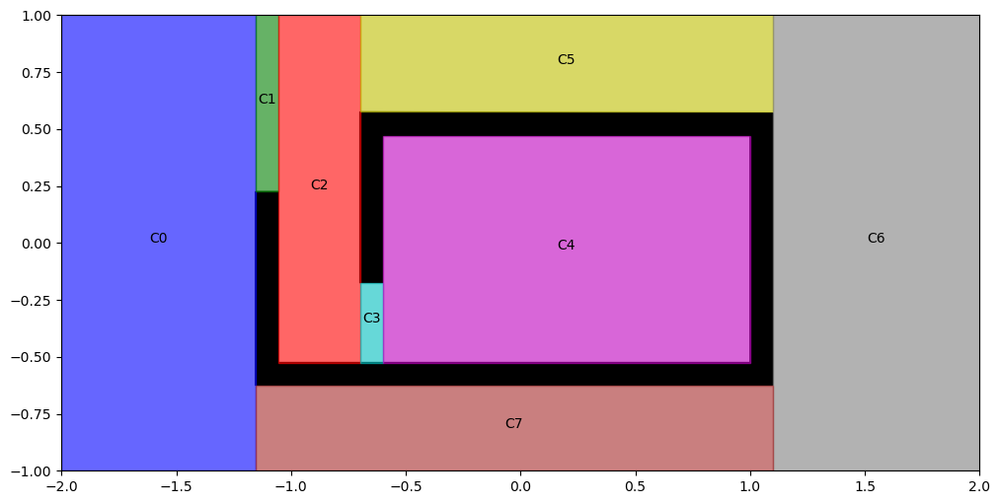
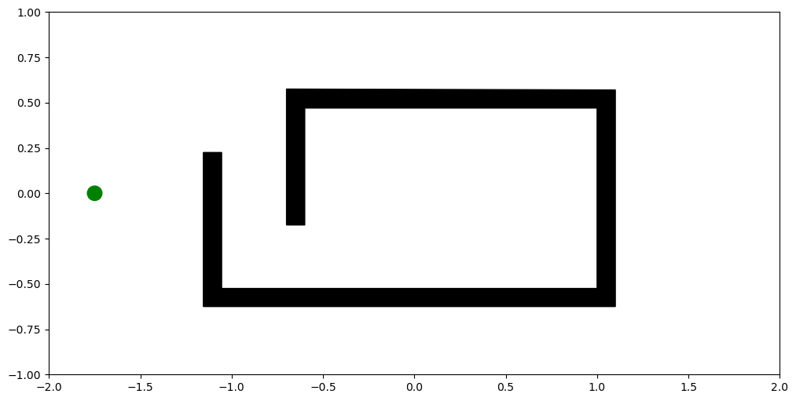
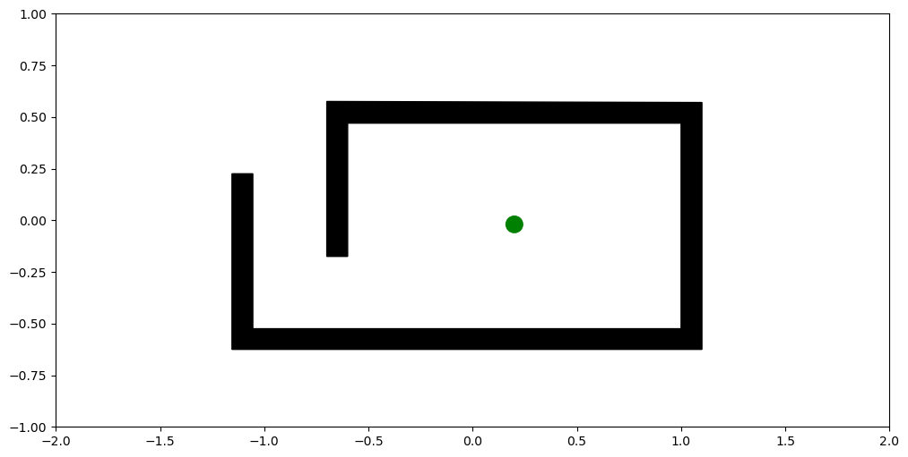
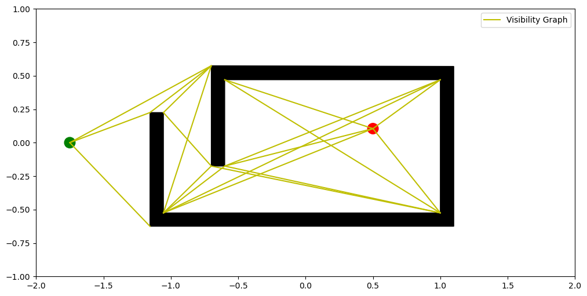
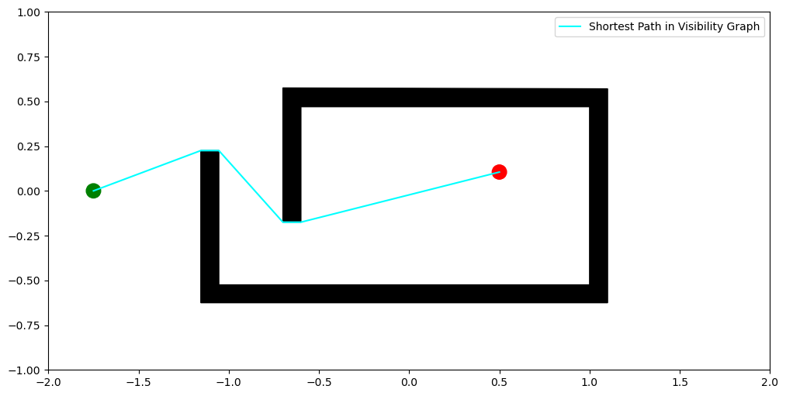
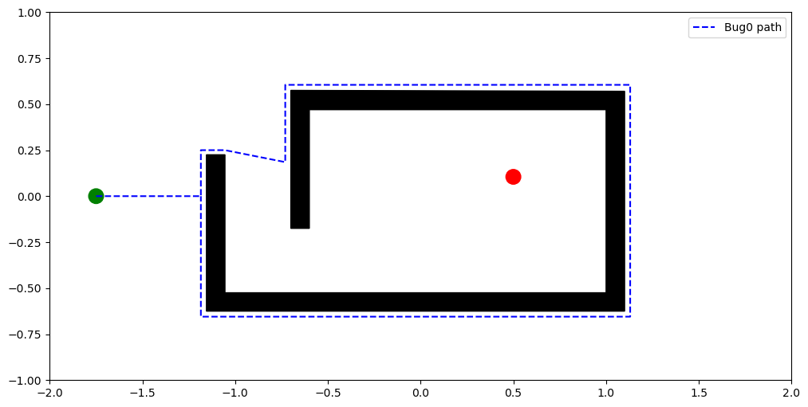
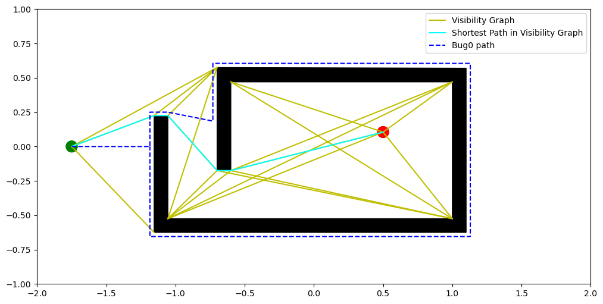
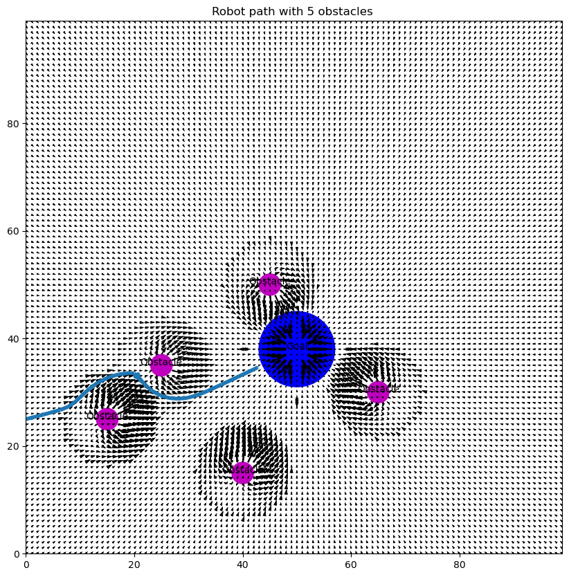

# Midsem Exam
## *Sushil Vemuri 19317*
 
 

## Q1
$ \text{Total Time Required to Cover a Cell} =  \text{Total Time to Moving Forward} + \text{Total Time of Turning}$  
$\Rightarrow \frac {\text{Total Distace Travelled Forward}} {\text{Forward speed}} + (\text{Number of Turns} \times \text{Time Taken on each Turn})$  
$\Rightarrow \frac {\text{Total Distace Travelled Forward}} {\text{Forward speed}} + (\text{Number of Turns} \times \frac{\pi}{2 \times \text{Rotational Speed}})$  
$\text{Rotational Speed} = 4.856 rad/s$  
$\text{Forward Speed} = 0.128 m/s$  

$\text{Total Time Required to Cover a Cell} = \frac {\text{Total Distace Travelled Forward}} {\text{0.128}} + (\text{Number of Turns} \times \frac{\pi}{9.712})$
 

1. Cell 0  
$\text{Total Time Required to Cover Cell} = \frac {19.92} {0.128} + (18 \times \frac{\pi}{9.712})$  
$= 161.44 \text{ sec}$
1. Cell 1  
$\text{Total Time Required to Cover Cell} = \frac {0.695} {0.128} + (0 \times \frac{\pi}{9.712})$  
$= 5.42\text{ sec}$
1. Cell 2  
$\text{Total Time Required to Cover Cell} = \frac {6.02} {0.128} + (6 \times \frac{\pi}{9.712})$  
$= 48.97\text{ sec}$
1. Cell 3  
$\text{Total Time Required to Cover Cell} = \frac {0.27} {0.128} + (0 \times \frac{\pi}{9.712})$  
$= 2.10\text{ sec}$
1. Cell 4  
$\text{Total Time Required to Cover Cell} = \frac {18.82} {0.128} + (36 \times \frac{\pi}{9.712})$  
$= 158.67\text{ sec}$
1. Cell 5  
$\text{Total Time Required to Cover Cell} = \frac {9.27} {0.128} + (42 \times \frac{\pi}{9.712})$  
$= 86.00\text{ sec}$
1. Cell 6  
$\text{Total Time Required to Cover Cell} = \frac {21.92} {0.128} + (20 \times \frac{\pi}{9.712})$  
$= 177.71\text{ sec}$
1. Cell 7  
$\text{Total Time Required to Cover Cell} = \frac {10.42} {0.128} + (54 \times \frac{\pi}{9.712})$  
$= 98.87\text{ sec}$  
  
$\text{Total Time to cover all cells} = 161.44+5.42+48.97+2.10+158.67+86.00+177.71+98.87$  
$= 739.18\text{ sec}$
$= 12.31\text{ min}$
 
 

## Q2
Cells:

 

Old Start Location:

In this Case the path followed is  $ C0 \to C1 \to C2 \to C3 \to C4 \to C3 \to C2 \to C5 \to C6 \to C7 $
 

New Start Location:

In this Case the path followed is  $ C4 \to C3 \to C2 \to C5 \to C6 \to C7 \to C0$
 

Therefore, the time for completion is lowered with this new start point.  
 
 

## Q3
 

Visibility Graph:

 

Manual Shortest Path on Visibility Graph:

 

Bug0 Path:

 

All Together:

 
 

## Q4
Parameters Used:  α = 50, β = 50, s = 7, r = 2

## Q5
My solution to the Pursuer Evader Problem was using the Art gallery Theorem to find the lest number of points which have complete visibility of the entire environment. With 2 pursuers we can occupy more of these points than if we had only 1 pursuer. So, we can see a lot more area with 2 pursuers. Thus 2 pursuers are better than 1.

## Q6
To ensure both pursuers dont collide, we will implement an obstacle avoidance algorithm like bug2 where in both the robots take a right turn whenever they encounter an obstacle. This ensures than when both bots are going to collide, they start moving in a circular pattern and reach their goal.